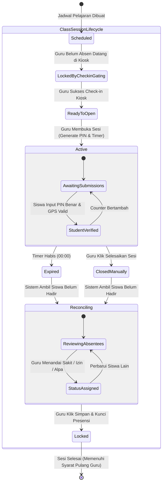

# PRD — Product Requirements Document: Sistem Absensi Kehadiran Siswa & Guru MA Ma'arif Cilageni Kadungora

## 1. Document Control & Metadata

| Properti | Rincian |
| :--- | :--- |
| **Nama Dokumen** | PRD — Sistem Absensi Kehadiran Siswa & Guru MA Ma'arif Cilageni Kadungora |
| **Versi Dokumen** | v2.1.0 (Restrukturisasi Standar PM 9-Bab) |
| **Status** | Approved / Ready for Implementation |
| **Product Owner / Penulis** | Tim Pengembang Sistem Madrasah MA Ma'arif |
| **Lead Architect / Reviewer** | Lead Software Architect & Technical Reviewer |
| **Tanggal Pembaruan Terakhir** | 2026-09-09 |
| **Target Rilis / Milestones** | Rilis MVP (Tahun Ajaran Aktif Madrasah) |
| **Catatan Revisi v2.1** | Sinkronisasi dengan implementasi riil — foto profil, toleransi geofence +25m, late threshold 07:15, token tolerance 40s, time gating strict, overlap kelas+guru, radius 30-500, CSV (bukan XLSX), audit koreksi & riwayat, role Admin generalisasi, MA saja (tanpa MTs). |

---

## 2. Ringkasan Eksekutif & Pernyataan Masalah

### 2.1 Latar Belakang & Masalah Utama
MA Ma'arif Cilageni Kadungora menghadapi tantangan operasional signifikan dalam pencatatan kehadiran harian siswa dan dewan guru yang selama ini masih mengandalkan presensi manual berbasis lembar kertas dan buku jurnal kelas. Metode konvensional ini menimbulkan sejumlah kelemahan krusial:
1. **Rentan Kecurangan & Titip Absen**: Siswa atau dewan guru berpotensi saling menitipkan paraf kehadiran tanpa kehadiran fisik nyata di kelas maupun lingkungan madrasah.
2. **Keterlambatan Rekapitulasi Manual**: Admin menghabiskan rata-rata 1,5 hingga 2 jam setiap hari untuk menghimpun, menyalin, dan merekapitulasi presensi dari puluhan buku jurnal kelas ke lembar rekapitulasi madrasah.
3. **Ketiadaan Validasi Lokasi & Presensi Fiktif**: Pihak madrasah tidak memiliki mekanisme objektif untuk memvalidasi apakah siswa benar-benar berada di lingkungan sekolah saat jam pelajaran berlangsung atau berada di luar madrasah (membolos).
4. **Masalah Antrean Fisik di Gerbang**: Model presensi terpusat di satu gerbang bagi ratusan siswa berisiko menimbulkan antrean panjang, kerumunan, dan kemacetan masuk pada jam-jam sibuk pagi hari.

### 2.2 Visi Produk & Sasaran Strategis
Sistem Absensi MA Ma'arif dirancang dengan arsitektur modern nir-antrean (*Zero-Queue Attendance Architecture*):
- **Siswa (Zero-Queue Classroom Attendance)**: Siswa melakukan konfirmasi kehadiran per jam mata pelajaran langsung dari bangku kelas masing-masing menggunakan **PIN Dinamis 4-Digit** yang diproteksi oleh **Geofencing GPS**. Sesi presensi dan form input PIN hanya akan terbuka di layar ponsel pintar siswa jika terdeteksi berada di dalam radius resmi madrasah (30–500 meter, default 75m, toleransi +25m), dan PIN otomatis hangus dalam jangka waktu terbatas (2–5 menit).
- **Dewan Guru & Staf (Kiosk Dynamic QR Ruang Guru)**: Presensi kedatangan dan kepulangan kerja dilakukan secara mandiri melalui pemindaian **Dynamic Hashed QR Code** yang diperbarui berkala setiap 20 detik di layar tablet Kiosk Ruang Guru, kebal terhadap manipulasi aplikasi pemalsu lokasi (*fake GPS*).
- **Integritas Alur Pengajaran Guru**: Sistem menerapkan aturan integritas terikat: guru wajib absen kedatangan di Kiosk sebelum dapat mengaktifkan sesi presensi kelas (*Check-in Gating*), serta wajib menuntaskan rekonsiliasi seluruh jadwal mapel sebelum diizinkan melakukan presensi kepulangan (*Teaching Completion Lock*).
- **Pelaporan Eksekutif Tanpa Akun Pimpinan**: Kepala Madrasah tidak dibebani operasional login aplikasi, melainkan menerima dokumen laporan resmi siap cetak (PDF berkop resmi bertanda tangan dan lembar Excel) yang disiapkan oleh Admin.

### 2.3 Metrik Keberhasilan & KPI Terukur
Keberhasilan implementasi produk dievaluasi menggunakan tolok ukur kuantitatif berikut:

| Metrik / KPI | Baseline (Metode Manual Kertas) | Target (Pasca-Implementasi Sistem) | Metode Pengukuran |
| :--- | :--- | :--- | :--- |
| **Waktu Rekapitulasi Presensi Harian** | 90–120 menit per hari | < 5 menit per hari | Waktu unduh & kompilasi laporan di Blade Custom Admin Panel |
| **Waktu Antrean Presensi Siswa** | 15–20 menit antrean gerbang | 0 menit (Zero-Queue, <10 detik dari bangku kelas) | Durasi pembukaan sesi hingga seluruh siswa terverifikasi |
| **Tingkat Kecurangan / Titip Absen** | Diperkirakan 5–10% insiden per bulan | 0% insiden titip absen | Audit log Geofence Haversine + validasi PIN dinamis ber-TTL |
| **Kecepatan Rekonsiliasi Izin/Sakit/Alpa** | Tertunda 1–2 hari kerja | < 2 menit pasca-sesi mapel berakhir | Selang waktu sesi berakhir hingga guru mengunci rekonsiliasi |
| **Tingkat Kepatuhan Jadwal Mengajar Guru** | Verifikasi manual tidak konsisten | 100% tuntas sebelum absen pulang | Validasi log mekanisme Teaching Completion Lock |
| **Kecepatan Akses Aplikasi Siswa (TTI)** | Tidak ada (manual) | < 1,5 detik pada koneksi 3G/4G | Audit performa Lighthouse / Network DevTools |

---

## 3. Cakupan & Asumsi Produk (Scope & Assumptions)

### 3.1 Asumsi Inti (Core Assumptions)
1. **Ketersediaan Perangkat**: Siswa dan guru memiliki smartphone yang dilengkapi browser modern (Chrome/Safari) dengan dukungan HTML5 Geolocation API dan kamera autofocus untuk pemindaian QR.
2. **Konektivitas Jaringan**: Lingkungan madrasah terjangkau jaringan seluler seluler 3G/4G atau jaringan Wi-Fi lokal madrasah.
3. **Titik Lokasi Geografis Madrasah**: Koordinat pusat madrasah (latitude & longitude) MA Ma'arif Cilageni Kadungora telah ditetapkan dengan radius toleransi default 75 meter (rentang konfigurasi 30–500 meter). Toleransi lunak GPS +25m diterapkan server-side (efektif 100m untuk setting 75m) untuk menangani GPS drift di dalam kelas.
4. **Terminal Kiosk Ruang Guru**: Tersedia setidaknya 1 unit tablet atau PC layar sentuh/monitor di pos Admin / Ruang Guru dengan pasokan daya stabil dan koneksi internet aktif.
5. **Kredensial Default**: Siswa login menggunakan NISN 10-digit dan tanggal lahir (`DDMMYYYY`), sedangkan guru login menggunakan NIP/NUPTK/No. Pegawai dan tanggal lahir (`DDMMYYYY`).
6. **Otomatisasi Kehadiran Harian**: Kehadiran siswa yang terverifikasi pada sesi mata pelajaran jam pertama di pagi hari secara otomatis diakui sebagai kehadiran harian madrasah siswa hari itu.

### 3.2 Cakupan MVP (In-Scope Capabilities)
- **Modul Kiosk Dynamic QR Ruang Guru**: Generator QR Code dinamis berbasis HMAC hash yang diperbarui setiap 20 detik untuk presensi datang dan pulang dewan guru.
- **Modul Geofence-Gated Discovery & PIN 4-Digit Kelas**: Pemeriksaan radius geofence server-side via formula Haversine, proteksi visibilitas kartu sesi presensi, serta verifikasi instan input PIN 4-digit siswa.
- **Modul Rekonsiliasi Ketidakhadiran Pasca-Sesi Guru**: Antarmuka satu sentuhan (tombol pill) bagi guru untuk menetapkan status Izin, Sakit, atau Alpa beserta catatan bagi siswa yang belum terverifikasi saat sesi hangus.
- **Integritas Alur Kerja Guru**: Penerapan *Check-in Gating* (wajib absen datang sebelum membuka kelas) dan *Teaching Completion Lock* (wajib menuntaskan seluruh kelas sebelum absen pulang).
- **Admin Panel Back-Office (Blade Custom Admin Panel — migrasi dari Filament)**: Pengelolaan master data siswa, guru, rombongan belajar (kelas), mata pelajaran, jadwal mingguan, konfigurasi koordinat madrasah, dan fitur 1-klik reset kata sandi ke format default.
- **Manajemen Foto Profil: Upload/ganti/hapus foto profil siswa & guru (jpeg/png/jpg/webp max 2MB) via `public/profile-photos`.**
- **Koreksi & Audit Trail Administratif: Admin dapat mengoreksi LessonAttendance pasca-LOCKED (wajib alasan 3-255 char) dengan log Audit Trail serta sinkronisasi DailyAttendance; riwayat per-siswa/per-guru 30 hari.**
- **Presensi Guru Harian Koreksi: Admin dapat membuat/memperbarui DailyAttendance guru (status HADIR/TERLAMBAT/IZIN/SAKIT/ALPA) dengan auto-default jam 07:00/07:30.**
- **Pusat Monitoring Real-Time & Dokumen Laporan**: Widget visual kehadiran harian, log pembukaan sesi guru, generator berkas laporan resmi format PDF berkop madrasah siap tanda tangan Kepala Madrasah, serta ekspor format CSV (UTF-8 BOM, route `/laporan/ekspor-excel`).
- **PWA Mobile-First Native-Like**: Tata letak dioptimalkan untuk viewport smartphone (360px–428px), ergonomi jempol (*bottom navigation & bottom sheets*), touch target ≥ 48px, dan haptic feedback (*vibration API*).

### 3.3 Batasan Luar Cakupan MVP (Out-of-Scope / Non-Goals)
Untuk memastikan delivery tepat waktu dan keandalan sistem, hal-hal berikut secara eksplisit **TIDAK TERMASUK** dalam cakupan MVP:
1. **Tanpa Portal / Akun Login Mandiri Kepala Madrasah**: Kepala Madrasah tidak diberikan akun login atau dashboard aplikasi mandiri. Kebutuhan supervisi dipenuhi melalui dokumen laporan fisik dan digital (PDF resmi dan lembar Excel) yang diserahkan secara terjadwal oleh Admin.
2. **Tanpa Integrasi WhatsApp / SMS Gateway Berbayar**: Tidak ada pengiriman pesan otomatis berbayar pihak ketiga kepada orang tua/wali siswa pada fase MVP ini.
3. **Tanpa Integrasi Penggajian (Payroll)**: Perhitungan honorarium mengajar atau gaji guru berada di luar cakupan sistem absensi ini.
4. **Tanpa Mesin Biometrik Hardware Eksternal**: Sistem murni mengandalkan kamera smartphone dan tablet Kiosk tanpa ketergantungan pada alat sidik jari (*fingerprint*) fisik terpisah.

---

## 4. Persona Pengguna & Matriks Hak Akses (RBAC)

### 4.1 Persona Pengguna
| Peran Pengguna | Konteks & Karakteristik | Kebutuhan Utama & Tujuan |
| :--- | :--- | :--- |
| **Siswa Madrasah** | Mengakses sistem via smartphone pribadi di ruang kelas; rentang usia 12–16 tahun; membutuhkan antarmuka simpel. | Mengisi presensi kehadiran kelas dengan cepat (<10 detik) via PIN tanpa antrean, melihat status kehadiran hari ini dan riwayat mapel. |
| **Dewan Guru / Pendidik** | Mengakses via smartphone dan tablet Kiosk Ruang Guru; bertanggung jawab atas ketertiban kelas dan jam mengajar. | Presensi datang/pulang di Ruang Guru, membuka sesi presensi mapel di kelas dengan PIN acak, dan merekonsiliasi siswa yang tidak hadir secara akurat. |
| **Admin** | Mengakses via komputer/laptop desktop kantor Admin; mengelola administrasi madrasah dan pelaporan pimpinan. | Memantau kehadiran madrasah secara live, mengelola master data siswa/guru/jadwal, mengoperasikan Kiosk, serta mencetak dokumen laporan resmi untuk Kepala Madrasah. |
| *(Stakeholder Eksternal)* **Kepala Madrasah** | Tidak login ke sistem; menerima dokumen fisik/digital laporan rekapitulasi kehadiran madrasah berkala. | Mengetahui persentase kedisiplinan siswa dan guru melalui lembar laporan PDF resmi bertanda tangan dan arsip Excel madrasah. |

### 4.2 Matriks Hak Akses Peran (Role-Based Access Control)
Sistem menerapkan kontrol akses ketat berdasarkan peran autentikasi:

| Fitur / Modul Fungsional | Siswa | Guru | Admin |
| :--- | :---: | :---: | :---: |
| **Login Sistem (NISN / NIP / Email)** | ✅ Akses Mandiri | ✅ Akses Mandiri | ✅ Akses Administrator |
| **Pembaruan Profil & Password Mandiri** | ✅ Akses | ✅ Akses | ✅ Akses |
| **Pindai Dynamic QR Kiosk (Check-in / Check-out)** | ❌ Tidak Ada Akses | ✅ Eksekusi Kamera | ❌ Tidak Ada Akses |
| **Buka Sesi Presensi Mapel & Generate PIN** | ❌ Tidak Ada Akses | ✅ Eksekusi (Tergate) | ❌ Tidak Ada Akses |
| **Lihat Kartu Sesi Geofence & Input PIN 4-Digit** | ✅ Eksekusi (Radius Valid) | ❌ Tidak Ada Akses | ❌ Tidak Ada Akses |
| **Rekonsiliasi Status Siswa (Izin / Sakit / Alpa)** | ❌ Tidak Ada Akses | ✅ Eksekusi Kelas Aktif | ✅ Override Administratif |
| **Kunci Sesi Presensi Kelas** | ❌ Tidak Ada Akses | ✅ Eksekusi | ✅ Akses Penuh |
| **Tampilan Kiosk Ruang Guru (Display Board)** | ❌ Tidak Ada Akses | ❌ Layar Publik Kiosk | ✅ Kelola & Aktifkan |
| **Dashboard Monitoring Live Madrasah** | ❌ Tidak Ada Akses | ❌ Tidak Ada Akses | ✅ Akses Penuh |
| **Manajemen Master Data (Siswa/Guru/Jadwal/Geofence)**| ❌ Tidak Ada Akses | ❌ Hanya Lihat Jadwal Sendiri | ✅ Full CRUD (Blade Custom Admin Panel) |
| **1-Klik Reset Password Pengguna ke Default** | ❌ Tidak Ada Akses | ❌ Tidak Ada Akses | ✅ Eksekusi Admin |
| **Cetak & Ekspor Laporan Resmi (PDF & Excel)** | ❌ Hanya Riwayat Sendiri | ❌ Rekap Kelas Sendiri | ✅ Generator Laporan Lengkap |

---

## 5. Kebutuhan Fungsional (Organisasi per Core Engine)

### 5.1 Engine 1: Kiosk Dynamic QR & Teacher Attendance Engine
- **User Story**: *Sebagai dewan guru madrasah, saya ingin mencatat jam kedatangan dan kepulangan kerja dengan memindai QR Code di Kiosk Ruang Guru, agar kehadiran fisik saya terverifikasi secara valid tanpa risiko manipulasi lokasi.*
- **Kriteria Penerimaan (Acceptance Criteria)**:
  - [ ] Layar tablet Kiosk menampilkan QR Code dinamis berbasis enkripsi HMAC token yang otomatis berganti setiap 20 detik disertai animasi countdown timer.
  - [ ] Sistem memvalidasi token QR yang dipindai kamera HP guru; jika token telah kedaluwarsa (>20 detik), pindaian langsung ditolak dengan instruksi memindai ulang kode baru.
  - [ ] Pindaian presensi kedatangan mencatat timestamp kedatangan presisi detik dan membuka status izin mengajar guru pada hari tersebut.
  - [ ] Pindaian presensi kepulangan memicu pengecekan validitas seluruh jadwal kelas hari itu (*Teaching Completion Lock*).
  - [ ] Jika seluruh jadwal mengajar hari itu telah berstatus *Completed & Locked*, presensi pulang sukses dicatat dan jam pulang tersimpan.
  - [ ] Jika masih terdapat sesi mengajar yang belum selesai atau belum direkonsiliasi, sistem menolak pindaian kepulangan dan menampilkan daftar spesifik mata pelajaran yang masih pending.
- **Logika & Aturan Bisnis**:
  - *Algoritma Token*: `token_hash = HMAC-SHA256(secret_key, timestamp_window_20s + kiosk_id)`.
  - *Teaching Completion Lock Rule*: `COUNT(class_schedules WHERE teacher_id = current_teacher AND date = today AND status != 'LOCKED') == 0`.

### 5.2 Engine 2: Geofence-Gated Discovery & PIN 4-Digit Classroom Engine
- **User Story**: *Sebagai siswa, saya ingin memasukkan PIN 4-digit yang diberikan guru di kelas langsung dari smartphone saya, agar kehadiran mapel saya tercatat seketika tanpa perlu mengantre di depan meja guru.*
- **Kriteria Penerimaan (Acceptance Criteria)**:
  - [ ] Sistem memeriksa koordinat GPS perangkat siswa via HTML5 Geolocation API saat halaman dibuka.
  - [ ] Jika jarak siswa terhadap koordinat resmi madrasah melebihi radius toleransi (default 75 meter), form input PIN dan kartu sesi presensi tersembunyi dengan pemberitahuan: *"Anda berada di luar lingkungan madrasah — Sesi presensi terkunci"*.
  - [ ] Jika siswa berada di dalam radius resmi madrasah, kartu sesi mata pelajaran yang sedang dibuka guru rombelnya otomatis muncul di layar ponsel siswa.
  - [ ] Guru hanya dapat membuka sesi kelas jika telah terbukti melakukan presensi kedatangan di Kiosk Ruang Guru pada hari tersebut (*Check-in Gating*). Jika belum, tombol aktivasi sesi terkunci dengan pesan instruksi.
  - [ ] Guru menentukan durasi sesi presensi (2–5 menit, default 3 menit), dan sistem menggenerasikan PIN acak 4-digit numerik unik (contoh: `8492`).
  - [ ] Siswa memasukkan PIN 4-digit melalui tombol keypad angka yang ergonomis; verifikasi berhasil memberikan konfirmasi instan berupa getaran haptic ganda dan indikator sukses berwarna hijau.
  - [ ] Begitu hitung mundur waktu habis (timer 00:00), sesi dan PIN otomatis hangus (*auto-expire*). Siswa tidak dapat lagi mengirimkan verifikasi kehadiran mandiri.
  - [ ] Siswa yang terverifikasi hadir pada sesi mata pelajaran jam pertama secara otomatis tercatat hadir pada presensi harian madrasah hari itu.
- **Logika & Aturan Bisnis**:
  - *Formula Jarak Haversine*: Perhitungan jarak dieksekusi secara server-side pada endpoint penerimaan koordinat untuk mencegah injeksi client-side.
  - *Toleransi*: `is_within = distance <= radius + 25m` (toleransi lunak +25m server-side; efektif 100m untuk setting 75m).
  - *Late threshold guru 07:15 WIB hardcode* (HADIR <=07:15, TERLAMBAT >07:15).
  - *Pencegahan Brute-Force*: Batas maksimal salah input PIN adalah 3 kali percobaan per sesi per siswa sebelum akun siswa dibekukan sementara selama 5 menit untuk sesi tersebut (Cache `pin_fail:{session}:{student}` TTL 300s).

### 5.3 Engine 3: Rekonsiliasi Ketidakhadiran & Penguncian Sesi Pasca-Kelas
- **User Story**: *Sebagai guru pengajar, saya ingin meninjau siswa yang belum terverifikasi saat sesi hangus dan menentukan status ketidakhadirannya secara cepat, agar rekapitulasi kelas tuntas sebelum saya meninggalkan ruang kelas.*
- **Kriteria Penerimaan (Acceptance Criteria)**:
  - [ ] Sesaat setelah durasi sesi berakhir atau guru menekan tombol *"Selesaikan Sesi"*, sistem otomatis menampilkan komponen laci bawah (*bottom sheet*) berisi daftar siswa rombel yang belum terverifikasi hadir.
  - [ ] Antarmuka menyediakan tombol pill satu sentuhan untuk setiap siswa: 🟡 Izin, 🔵 Sakit, atau 🔴 Alpa (pilihan default bila tidak hadir tanpa keterangan).
  - [ ] Guru dapat menyertakan catatan keterangan singkat (contoh: *"Surat dokter menyusul"*, *"Izin acara keluarga"*).
  - [ ] Menekan tombol *"Simpan & Kunci Presensi"* mengunci status kehadiran seluruh siswa di sesi tersebut secara permanen ke basis data.
  - [ ] Sesi kelas berganti status menjadi `LOCKED`, memenuhi syarat untuk pemenuhan *Teaching Completion Lock* guru di akhir jam kerja.
- **Logika & Aturan Bisnis**:
  - Siswa yang terverifikasi via PIN sebelum sesi hangus memperoleh status `HADIR`.
  - Siswa yang belum terverifikasi otomatis berstatus default `ALPA` sebelum guru mengubahnya menjadi `IZIN` atau `SAKIT` pada formulir rekonsiliasi.
  - Setelah status `LOCKED`, hanya Admin yang dapat melakukan revisi kehadiran dengan kewajiban mengisi alasan audit pada log sistem.

### 5.4 Engine 4: Blade Custom Admin Panel & Master Data Management
- **User Story**: *Sebagai Admin, saya ingin mengelola master data madrasah dan jadwal secara terpusat melalui panel web yang mudah digunakan, agar operasional kehadiran harian berjalan tertib.*
- **Kriteria Penerimaan (Acceptance Criteria)**:
  - [ ] CRUD Data Pengguna: Siswa (NISN, Nama, Tanggal Lahir, Kelas) dan Guru (NIP/NUPTK, Nama, Tanggal Lahir) dan Admin (termasuk foto profil).
  - [ ] CRUD Rombongan Belajar (Kelas 7A, 7B, 8A, 9A, dsb.) dan Tahun Ajaran aktif.
  - [ ] CRUD Mata Pelajaran dan Jadwal Pelajaran Mingguan per kelas dan per guru pengampu.
  - [ ] Konfigurasi Madrasah: Pengaturan koordinat latitude/longitude madrasah, radius geofence (30-500m, default 75m), jam masuk batas keterlambatan, dan jam pulang resmi.
  - [ ] Fitur 1-Klik Reset Password: Admin dapat memulihkan kata sandi akun siswa atau guru yang lupa langsung dari tabel Admin Panel ke nilai default tanggal lahir (`DDMMYYYY`) tanpa alur email yang rumit.
- **Logika & Aturan Bisnis**:
  - Validasi keunikan nomor identitas: `identity_number` (NISN/NIP) bersifat unik dalam tabel pengguna.
  - Sanitasi jadwal: Sistem mencegah tumpang tindih (*schedule overlap*) jadwal mengajar guru pada slot jam pelajaran dan hari yang sama.
  - Sanitasi jadwal ganda: cegah overlap guru DAN overlap rombel kelas pada slot hari+jam yang sama.
  - Time gating strict: sesi hanya dapat dibuka pada hari+jam sesuai jadwal (validasi `day_of_week` & `start_time`/`end_time` server-side).

### 5.5 Engine 5: Monitoring Real-Time & Pusat Dokumen Laporan Eksekutif
- **User Story**: *Sebagai Admin, saya ingin memantau kehadiran hari ini secara live dan mencetak dokumen laporan resmi untuk diserahkan kepada Kepala Madrasah, agar pimpinan madrasah memperoleh laporan absensi yang valid dan bertanda tangan resmi.*
- **Kriteria Penerimaan (Acceptance Criteria)**:
  - [ ] Dashboard utama menyajikan widget ringkasan statistik kehadiran harian madrasah (total hadir, belum hadir, terlambat, izin, sakit, alpa) yang diperbarui secara langsung.
  - [ ] Panel log real-time menampilkan status pembukaan sesi kelas dan konfirmasi rekonsiliasi oleh masing-masing dewan guru pengajar.
  - [ ] Modul Cetak PDF Laporan Resmi: Menghasilkan dokumen laporan kehadiran resmi berlogo MA Ma'arif Cilageni Kadungora dengan format standar madrasah, memuat rekapitulasi persentase kehadiran, kolom tanda tangan Admin, dan kolom pengesahan bertanda tangan Kepala Madrasah.
  - [ ] Modul Ekspor CSV: Menghasilkan berkas `.csv` UTF-8 BOM (route `/laporan/ekspor-excel`) terstruktur yang memuat seluruh rekaman kehadiran per siswa, per kelas, dan per mata pelajaran untuk keperluan arsip digital madrasah.
  - [ ] Koreksi & Audit: filter presensi-siswa (tanggal/kelas/status/search), presensi-guru, log audit Paginated, riwayat per-individu (30 hari per-siswa/per-guru).
- **Logika & Aturan Bisnis**:
  - Filter laporan mencakup: rentang tanggal fleksibel (harian, mingguan, bulanan, semester), tingkatan kelas/rombel, atau per individu siswa/guru.
  - Export laporan: CSV BOM UTF-8 (bukan XLSX).

### 5.6 Engine 6: Manajemen Autentikasi & Sesi Tanpa Hambatan (Seamless Auth)
- **User Story**: *Sebagai pengguna sistem (siswa/guru), saya ingin masuk ke aplikasi dengan kredensial yang mudah diingat tanpa perlu login berulang setiap hari, agar presensi pagi dapat dilakukan seketika.*
- **Kriteria Penerimaan (Acceptance Criteria)**:
  - [ ] Siswa masuk menggunakan NISN (10-digit) dengan kata sandi default Tanggal Lahir format `DDMMYYYY`.
  - [ ] Guru masuk menggunakan NIP / NUPTK / No. Pegawai dengan kata sandi default Tanggal Lahir format `DDMMYYYY`.
  - [ ] Admin masuk menggunakan email resmi madrasah dan kata sandi administrator.
  - [ ] Mendukung sesi persisten PWA (*Remember Me* berbasis token terenkripsi di local storage/cookie aman) sehingga siswa dan guru tidak perlu login ulang setiap membuka aplikasi di pagi hari.
  - [ ] Pengguna dapat memperbarui kata sandi secara mandiri pada menu pengaturan profil akun.
  - [ ] Foto Profil: endpoint POST `/profile/photo` & DELETE `/profile/photo` (image jpeg/png/jpg/webp max 2MB) untuk semua role via `public/profile-photos`.
- **Logika & Aturan Bisnis**:
  - Seluruh password di-hash menggunakan algoritma Bcrypt / Argon2ID dengan cost factor aman.
  - Foto profil disimpan sebagai `profile_photo_path` nullable di tabel `users`; validasi MIME & ukuran 2MB server-side.

---

## 6. Kasus Ekstrem & Penanganan Pengecualian (Edge Cases)

| Kasus Ekstrem / Kegagalan | Kondisi Pemicu | Perilaku Sistem & Penanganan Cadangan | Umpan Balik Pengguna & Pemulihan |
| :--- | :--- | :--- | :--- |
| **Koneksi Seluler Terputus saat Input PIN** | Koneksi internet smartphone siswa mati/hilang saat mengirim PIN | Sistem di browser menyimpan payload submission sementara dan melakukan retry otomatis (maksimal 3 kali dalam 15 detik) | Muncul banner status: *"Koneksi terputus. Mencoba mengirim kembali..."* disertai tombol kirim manual |
| **Deviasi Koordinat GPS (GPS Drift di Kelas)** | HP siswa di dalam kelas tetapi melaporkan akurasi rendah (>100m) karena atap gedung madrasah | Sistem menerapkan toleransi `radius+25m` server-side (efektif 100m untuk setting 75m); evaluasi `distance <= radius + 25m` tetap dianggap `is_within` | Notifikasi di HP siswa: *"Akurasi GPS rendah. Pastikan Anda berada dekat jendela atau buka ulang GPS perangkat"* — entri tetap HADIR selama dalam toleransi +25m |
| **Guru Berupaya Buka Sesi Sebelum Check-in Kiosk** | Guru langsung ke kelas dan mencoba mengaktifkan sesi kelas tanpa scan Kiosk Ruang Guru | Sistem memblokir eksekusi pembukaan sesi kelas (*Check-in Gating*); tombol buka sesi dinonaktifkan di level backend API | Alert modal peringatan: *"Akses Ditolak: Anda belum melakukan presensi kedatangan di Kiosk Ruang Guru hari ini. Silakan scan Kiosk terlebih dahulu"* |
| **Guru Berupaya Check-out Kiosk Sebelum Selesai Mengajar** | Guru memindai QR kepulangan di Kiosk tetapi masih ada jadwal mapel yang belum berstatus `LOCKED` | Sistem menolak pencatatan jam kepulangan (*Teaching Completion Lock*) dan menolak penulisan waktu check-out | Layar menampilkan pop-up daftar kelas yang pending: *"Presensi Pulang Terkunci: Masih ada jadwal kelas yang belum tuntas direkonsiliasi. Selesaikan sesi kelas terlebih dahulu"* |
| **Waktu PIN Kedaluwarsa Tepat saat Siswa Menekan Kirim** | Siswa menekan tombol kirim di milidetik saat timer 00:00 tercapai di server | Validasi server-side memberikan grace period toleransi jaringan 5 detik pasca-timer berakhir | Jika melebihi 5 detik, sistem mengembalikan status `SESSION_EXPIRED` dan mengarahkan siswa menunggu rekonsiliasi manual guru |
| **Siswa Mencoba Mengakses dari Luar Madrasah** | Siswa di rumah atau warung di luar radius 75m membuka aplikasi | Geolocation API mengevaluasi jarak > 75m; kartu sesi kelas dan form PIN disembunyikan sepenuhnya dari antarmuka | Layar menampilkan ilustrasi lokasi madrasah dengan pesan: *"Anda terdeteksi di luar lingkungan madrasah. Sesi presensi terkunci"* |
| **Token QR Kiosk Kedaluwarsa saat Guru Memindai** | Guru menembakkan kamera tepat pada detik ke-20 saat QR sedang berganti | Sistem menerapkan toleransi 40s (current + previous window): token window saat ini dan 1 window sebelumnya (±20s) masih diterima; di luar itu berstatus `EXPIRED` | Tampilan kamera HP guru menampilkan toast: *"Token QR kedaluwarsa. Arahkan kamera kembali ke kode QR baru di layar Kiosk"* (jika >40s) |
| **Perangkat Tablet Kiosk Freeze atau Terputus Listrik** | Perangkat tablet di pos Admin mati atau browser mengalami crash | Kiosk PWA memiliki service worker auto-reload dan mekanisme fallback tampilan PIN darurat Kiosk yang dapat di-generate Admin | Admin menerima notifikasi status Kiosk offline di dashboard Blade Custom Admin Panel dan dapat melakukan restart cepat |
| **Siswa / Guru Lupa Kata Sandi Akun** | Pengguna telah mengubah password default lalu lupa kredensial login | Pengguna melapor kepada Admin di kantor madrasah | Admin mengklik tombol *"Reset Password"* pada baris pengguna di Blade Custom Admin Panel; kata sandi seketika kembali ke Tanggal Lahir (`DDMMYYYY`) |

---

## 7. Kebutuhan Non-Fungsional (NFR)

### 7.1 Usabilitas & Aksesibilitas (Standar Wajib Mobile-First)
- **Arsitektur Breakpoint Smartphone**: Desain antarmuka utama (Siswa & Guru) dirancang berbasis smartphone (*mobile-first*) dengan rentang viewport utama **360px hingga 428px** (Android dan iOS). Antarmuka desktop diperlakukan sebagai peningkatan progresif (*progressive enhancement*).
- **Konfigurasi Meta Viewport Native**:
  ```html
  <meta name="viewport" content="width=device-width, initial-scale=1.0, maximum-scale=1.0, user-scalable=no, viewport-fit=cover">
  ```
  Mendukung integrasi penuh *safe area insets* perangkat berponi (`env(safe-area-inset-top)` dan `env(safe-area-inset-bottom)`).
- **Ergonomi Jempol (Thumb-Zone Navigation)**:
  - Bilah navigasi bawah tetap (*fixed bottom navigation bar*) setinggi 64px dengan 4 menu utama (Beranda, Riwayat, Jadwal, Profil) serta Tombol Verifikasi Cepat di tengah berukuran 56px × 56px dengan warna Hijau Ma'arif (`#15803D`).
  - Komponen interaksi dialog konfirmasi dan rekonsiliasi ketidakhadiran wajib menggunakan laci bawah (*bottom sheet drawers*).
- **Standar Area Sentuh (Touch Targets)**: Seluruh tombol interaktif, kartu sesi, dan kontrol navigasi wajib memiliki dimensi area sentuh minimal **48px × 48px** dengan jarak antar-elemen minimal 8px sesuai standar WCAG 2.1 AA.
- **Respons Taktil (Haptic Feedback)**: Setiap interaksi penting (verifikasi PIN berhasil, penekanan keypad numerik) memicu getaran mikro responsif (`navigator.vibrate`) dan animasi mikro (`active:scale-95 duration-75`).
- **Papan Ketik Angka Otomatis**: Bidang input NISN, NIP, dan PIN 4-digit wajib menyertakan atribut `inputmode="numeric"` untuk memunculkan papan tombol angka besar pada smartphone.

### 7.2 Performa & Anggaran Latensi
- **Time to Interactive (TTI)**: Halaman aplikasi PWA siswa dan guru harus dapat berinteraksi penuh dalam waktu **< 1,5 detik** pada koneksi seluler 3G/HSDPA.
- **Ukuran Aset Awal**: Ukuran bundel CSS dan JavaScript awal terkompresi maksimal **< 120 KB**.
- **Anggaran Respon Validasi PIN**: Endpoint pengujian PIN dan geolokasi wajib memberikan respons tuntas dalam waktu **< 250 ms** pada kondisi 500 koneksi bersamaan.
- **Rotasi QR Kiosk**: Waktu render pembaruan QR Code di tablet Kiosk **< 100 ms** setiap interval 20 detik.

### 7.3 Keamanan & Integritas Data
- **Validasi Server-Side Mutlak**: Validasi formula Haversine geofencing dan pencocokan PIN dinamis wajib diproses di server backend; data koordinat mentah dari client tidak boleh dipercaya tanpa verifikasi batas kewajaran.
- **Enkripsi Kredensial & Sesi**: Enkripsi transmisi wajib menggunakan TLS 1.3 / HTTPS. Password pengguna di-hash menggunakan algoritma Bcrypt (cost factor 12) atau Argon2ID.
- **Keamanan Token QR Dinamis**: Hash QR Kiosk ditandatangani menggunakan HMAC-SHA256 dengan secret key yang dirotasi secara berkala dan hanya valid dalam jendela waktu 20 detik.
- **Perlindungan Brute Force**: PIN: max 3 salah per sesi per siswa selama 5 menit (Cache `pin_fail:{session}:{student}` TTL 300s); di luar itu submission diblokir sementara hingga TTL habis. Rate limit autentikasi tetap via throttling Laravel.

### 7.4 Keandalan & Keteramatan (Reliability & Observability)
- **Target Ketersediaan Sistem**: Uptime minimum **99,5%** selama jam operasional aktif madrasah (pukul 06:30 hingga 16:00 WIB).
- **Pencatatan Audit (Audit Trail)**: Seluruh transaksi perubahan status kehadiran siswa (termasuk status awal dari PIN, perubahan rekonsiliasi oleh guru, atau perubahan administratif oleh Admin) dicatat secara terperinci mencakup user_id pengubah, timestamp, status lama, status baru, dan alasan perubahan.
- **Offline Shell PWA**: Penerapan Service Worker untuk meng-cache aset statis utama (layout, stylesheet Tailwind, icon SVG, font) sehingga antarmuka terbuka instan meskipun terjadi fluktuasi sinyal seluler sementara.

---

## 8. Alur Pengguna & Diagram Visual

### 8.1 Alur Pengguna Ujung-ke-Ujung (ASCII Diagram)

#### Alur 1: Presensi Datang & Pulang Dewan Guru (Kiosk Ruang Guru)
```text
[Guru Tiba di Madrasah] ──> [Masuk ke pos Admin / Ruang Guru]
                     │
                     ▼
[Buka PWA di HP] ─────────> [Pilih Menu "Scan Presensi Datang"]
                     │
                     ▼
[Scan Dynamic QR Kiosk] ──> [Validasi Token Hash 20s + Geofence Madrasah]
                     │
                     ▼
[Jam Datang Tercatat] ────> [Gating Terbuka: Fitur Buka Sesi Kelas AKTIF]
                     │
                     ▼
      [Guru Melaksanakan Pembelajaran di Kelas Sepanjang Hari]
                     │
                     ▼
[Selesai Mengajar & Kunci Rekonsiliasi Seluruh Mapel Hari Ini]
                     │
                     ▼
[Kembali ke Ruang Guru] ──> [Pilih Menu "Scan Presensi Pulang"]
                     │
        ┌────────────┴────────────┐
        ▼                         ▼
[Ada Mapel Belum Terkunci]   [Seluruh Mapel Hari Ini LOCKED]
        │                         │
        ▼                         ▼
[Pindaian DITOLAK!]          [Pindaian BERHASIL!]
(Peringatan: Mapel pending)  (Jam Pulang Tersimpan & Tugas Tuntas)
```

#### Alur 2: Presensi Sesi Mapel Siswa di Kelas & Rekonsiliasi Guru
```text
[Guru di Ruang Kelas] ───> [Buka Jadwal Mapel Aktif di HP Guru]
                     │
                     ▼
[Cek Status Check-in] ───> [Terverifikasi Hadir di Kiosk Pagi Ini]
                     │
                     ▼
[Tentukan Durasi (mis: 3m) & Klik "Buka Sesi Presensi"]
                     │
                     ▼
[Sistem Generate PIN Dinamis (mis: "8492") & Countdown Timer Aktif]
                     │
                     ▼
[Guru Mengumumkan PIN di Papan Tulis / Secara Lisan di Kelas]
                     │
                     ▼
[Siswa Membuka PWA dari Bangku Kelas Masing-Masing]
                     │
        ┌────────────┴────────────┐
        ▼                         ▼
[GPS: Di Luar Madrasah]     [GPS: Di Lingkungan Madrasah <=75m]
        │                         │
        ▼                         ▼
[Sesi TERKUNCI & SEMBUNYI]  [Muncul Kartu: "Sesi Aktif: Fikih 8A (02:59)"]
                                  │
                                  ▼
                            [Siswa Ketik PIN 4-Digit: "8492"]
                                  │
                                  ▼
                            [SUKSES! Haptic Vibrate + Status HADIR]
                            (Counter Live Siswa Hadir di HP Guru Naik)
                                  │
                                  ▼
               [Timer Habis (00:00) / Guru Klik "Selesaikan Sesi"]
                                  │
                                  ▼
               [PIN Hangus Otomatis — Form Input Siswa Tertutup]
                                  │
                                  ▼
               [Muncul Laci Bawah di HP Guru: "Rekonsiliasi (N Siswa)"]
               ┌─────────────────────────────────────────────────────┐
               │ 1. Ahmad Fauzi ──> [ 🟡 Izin ] [ 🔵 Sakit ] [ 🔴 Alpa ]│
               │ 2. Siti Aisyah ──> [ 🟡 Izin ] [ 🔵 Sakit ] [ 🔴 Alpa ]│
               └─────────────────────────────────────────────────────┘
                                  │
                                  ▼
               [Guru Tetapkan Status 1-Sentuhan + Catatan Singkat]
                                  │
                                  ▼
               [Guru Klik "Simpan & Kunci Presensi"]
               (Sesi Berstatus LOCKED & Rekapitulasi Tersimpan Permanen)
```

### 8.2 Diagram Transisi State Operasional (State Diagram)



---

## 9. Spesifikasi Teknis & Arsitektur (Appendix / TRD Bridge)

### 9.1 Diagram Arsitektur Sistem

```mermaid
graph TD
    ClientSiswa[Siswa Smartphone PWA] <-->|HTTPS / Geolocation API / PIN Post| AppServer[Laravel 11 Web & API Server]
    ClientGuru[Guru Smartphone & Browser] <-->|HTTPS / Session Gating / QR Scanner| AppServer
    KioskDisplay[Kiosk Tablet Ruang Guru] <-->|HTTPS / Dynamic QR HMAC Token 20s| AppServer
    AdminDashboard[Admin Desktop] <-->|Blade Custom Admin Panel (layouts/admin) / HTTPS| AppServer

    AppServer <-->|Eloquent ORM / Queries| MainDB[(MySQL 8.0+ Database)]
    AppServer <-->|Cache Store / PIN Token TTL / Rate Limiter| CacheStore[(Redis / File Cache)]

    subgraph Classroom Attendance Core
        ClientGuru -->|1. Buka Sesi Kelas & PIN Acak| AppServer
        AppServer -->|2. Simpan PIN Sementara ber-TTL| CacheStore
        AppServer -->|3. Kirim Kartu Sesi Hanya ke Siswa Valid GPS| ClientSiswa
        ClientSiswa -->|4. Kirim PIN 4-Digit + Koordinat GPS| AppServer
        AppServer -->|5. Validasi Jarak Haversine & PIN| CacheStore
        AppServer -->|6. Catat Log Presensi Siswa Hadir| MainDB
        ClientGuru -->|7. Kunci Rekonsiliasi Izin Sakit Alpa| AppServer
        AppServer -->|8. Kunci Sesi & Simpan Rekapitulasi| MainDB
    end

    subgraph Reporting Engine
        AdminDashboard -->|Unduh Laporan Format Excel| AppServer
        AdminDashboard -->|Cetak PDF Resmi Kepala Madrasah| AppServer
    end
```

### 9.2 Model Data & Diagram Hubungan Entitas (ERD)

```mermaid
erDiagram
    classrooms ||--o{ class_schedules : "has schedules"
    subjects ||--o{ class_schedules : "included in schedules"
    users ||--o{ class_schedules : "teaches schedule"
    users ||--o{ daily_attendances : "logs daily check"
    users ||--o{ lesson_attendances : "student attending"
    users ||--o{ lesson_attendances : "teacher confirming"
    class_schedules ||--o{ lesson_attendances : "has attendance records"
    class_schedules ||--o{ class_sessions : "has sessions"
    users ||--o{ class_sessions : "opened by teacher"

    users {
        uuid id PK
        string identity_number UK
        string name
        string email
        date birth_date
        string password_hash
        string role
        string phone_number
        string profile_photo_path nullable
        boolean is_active
        timestamp created_at
        timestamp updated_at
    }

    classrooms {
        uuid id PK
        string name
        string grade_level
        string academic_year
        timestamp created_at
        timestamp updated_at
    }

    subjects {
        uuid id PK
        string code UK
        string name
        timestamp created_at
        timestamp updated_at
    }

    class_schedules {
        uuid id PK
        uuid classroom_id FK
        uuid subject_id FK
        uuid teacher_id FK
        string day_of_week
        time start_time
        time end_time
        timestamp created_at
        timestamp updated_at
    }

    school_locations {
        uuid id PK
        string name
        float latitude
        float longitude
        integer radius_meters
        boolean is_active
        timestamp created_at
        timestamp updated_at
    }

    class_sessions {
        uuid id PK
        uuid schedule_id FK
        uuid teacher_id FK
        string pin_code
        integer duration_minutes
        timestamp started_at
        timestamp expires_at
        string status
        timestamp created_at
    }

    daily_attendances {
        uuid id PK
        uuid user_id FK
        date attendance_date
        time check_in_time
        time check_out_time
        string check_in_status
        string check_out_status
        float check_in_latitude
        float check_in_longitude
        float check_out_latitude
        float check_out_longitude
        float check_in_distance_meters
        timestamp created_at
        timestamp updated_at
    }

    lesson_attendances {
        uuid id PK
        uuid schedule_id FK
        uuid student_id FK
        date attendance_date
        string status
        string notes
        uuid confirmed_by FK
        timestamp verified_at
        float latitude
        float longitude
        uuid session_id FK nullable
        float distance_meters nullable
        timestamp created_at
        timestamp updated_at
    }
```

### Ringkasan Tabel Basis Data
| Nama Tabel | Deskripsi & Peran Entitas |
| :--- | :--- |
| `users` | Data akun pengguna sistem (Siswa, Guru, Admin) dengan identitas login `identity_number` (NISN / NIP), `birth_date` (dasar password default `DDMMYYYY`), dan `role`. |
| `classrooms` | Master data rombongan belajar / kelas (contoh: 7A, 7B, 8A, 9A) dan tahun ajaran aktif. |
| `subjects` | Master data mata pelajaran madrasah (contoh: Al-Qur'an Hadits, Akidah Akhlak, Fikih, Matematika). |
| `class_schedules` | Jadwal mingguan mata pelajaran yang mengaitkan kelas, mapel, guru pengampu, hari, serta slot waktu. |
| `school_locations` | Konfigurasi koordinat geofence madrasah (titik koordinat MA Ma'arif Cilageni Kadungora) beserta radius toleransi meter. |
| `class_sessions` | Data sesi presensi kelas aktif yang memuat PIN 4-digit acak, durasi menit, batas waktu kedaluwarsa (*expires_at*), dan status siklus sesi. |
| `daily_attendances` | Rekam presensi harian datang & pulang guru/staf via Kiosk Ruang Guru serta otomatisasi kehadiran harian siswa dari mapel jam pertama. |
| `lesson_attendances` | Rekam kehadiran sesi pelajaran per siswa beserta status hasil input PIN atau konfirmasi rekonsiliasi guru (Hadir, Izin, Sakit, Alpa), catatan alasan, dan foreign key guru validator (`confirmed_by`), serta `session_id` (FK ke class_sessions, nullable) dan `distance_meters` (jarak GPS saat verifikasi, nullable). |

> **Catatan:** Export laporan: CSV BOM UTF-8 (bukan XLSX) via `/laporan/ekspor-excel`.

### 9.3 Rekomendasi Tech Stack
- **Framework Utama**: Laravel 11 (PHP 8.2+) dengan arsitektur modular yang stabil dan efisien untuk kebutuhan instansi pendidikan.
- **Admin Engine**: Blade Custom Admin Panel (layouts/admin) — sebelumnya direncanakan Filament.
- **Frontend & PWA**: Blade / Livewire + Alpine.js + Tailwind CSS dengan optimasi *responsive viewport* khusus smartphone.
- **Basis Data**: MySQL 8.0+ / MariaDB 10.6+.
- **Cache & Ephemeral Session Store**: Redis / Database File Cache untuk manajemen TTL PIN dinamis dan rate limiter.
- **Client Web APIs**: W3C HTML5 Geolocation API, HTML5 MediaDevices Camera Stream API, W3C Vibration API (`navigator.vibrate`), HTML5 Canvas QR Decoder.

### 9.4 Token Sistem Desain (Design System Tokens)
Mengadopsi identitas visual resmi bernuansa **Hijau Ma'arif NU — Formal Modern**:

- **Token Tipografi**:
  - *Heading Font*: `Plus Jakarta Sans`, `Inter`, `sans-serif` (elegan, tegas, dan modern).
  - *Body / Interface Font*: `Inter`, `system-ui`, `sans-serif` (tingkat keterbacaan tinggi pada layar ponsel).
  - *Monospace Font (Angka PIN, Countdown Timer, Hash QR, Jam)*: `JetBrains Mono`, `monospace` (memastikan angka tidak bergeser).
- **Token Palet Warna**:
  - *Primary (Ma'arif Green)*: `#15803D` (Warna identitas madrasah, tombol aksi utama, header menu aktif, status hadir).
  - *Primary Dark (Deep Forest)*: `#166534` (Header sidebar, state hover tombol utama, aksen navbar formal).
  - *Primary Light (Emerald Tint)*: `#DCFCE7` (Latar belakang badge status sukses/hadir, highlight baris tabel aktif).
  - *Accent (Gold Ma'arif)*: `#EAB308` (Aksen lambang/bintang, lencana penghargaan kedisiplinan, indikator hitung mundur).
  - *Neutral Background*: `#F8FAFC` (Slate 50 — latar belakang utama aplikasi yang bersih dan teduh).
  - *Card & Surface*: `#FFFFFF` (Latar belakang kartu dashboard, panel formulir, modal, dan bottom sheets).
  - *Text Primary*: `#0F172A` (Slate 900 — warna teks judul utama, label formulir, dan angka penting).
  - *Text Muted*: `#64748B` (Slate 500 — teks keterangan sekunder, timestamp, dan petunjuk bantuan).
  - *Success Status*: `#16A34A` (Hadir tepat waktu, koordinat terverifikasi di area madrasah).
  - *Warning Status*: `#D97706` (Status izin, timer sesi mendekati hangus, verifikasi marginal).
  - *Danger Status*: `#DC2626` (Status alpa, di luar radius madrasah, token kedaluwarsa).
- **Token Geometri Komponen**:
  - *Corner Radius*: `rounded-lg` (8px) untuk tombol dan field input; `rounded-xl` (12px) untuk kartu sesi.
  - *Touch Target Dimension*: Area sentuh minimum 48px × 48px dengan jarak antar-elemen minimal 8px.
  - *Bottom Navigation Bar*: Ketinggian tetap 64px, z-index 50, dengan elevasi shadow halus.
  - *Keypad Numerik PIN*: Tombol angka berukuran minimal 60px × 60px yang nyaman untuk input satu jempol.

### 9.5 Dev & QA Tooling (Non-MVP)
> **Kategori: Non-MVP / Alat Bantu Pengembangan & Pengujian — tidak termasuk fitur produksi madrasah.**

- **Time Simulator (`TimeSimulatorService`)**: Memungkinkan simulasi waktu aplikasi tanpa mengubah jam server/OS untuk keperluan QA skenario batas waktu (late threshold, sesi PIN, token QR, time gating jadwal).
  - Penyimpanan: file `framework/simulated_time.json` (read/write via `TimeSimulatorService`).
  - Aktivasi: route `POST /dev/time-simulator` (hanya environment `local`/`testing`; diblokir di `production`) untuk set/reset waktu simulasi.
  - Middleware: `SimulateTime` — jika query `?simulate_time=` tersedia (dan app bukan production), override `now()` aplikasi via `Carbon::setTestNow()`.
  - Widget UI: `partials/time-simulator` — panel dev mengambang (fixed bottom) dengan presets: `07:00`, `07:30`, `+3m`, `14:00` serta tombol Reset; menampilkan banner "SIMULATED TIME" saat aktif.
  - Kegunaan QA: verifikasi HADIR vs TERLAMBAT di batas 07:15, kedaluwarsa PIN 2–5 menit, toleransi token QR 40s, dan validasi jadwal `day_of_week + time` tanpa menunggu jam riil.
